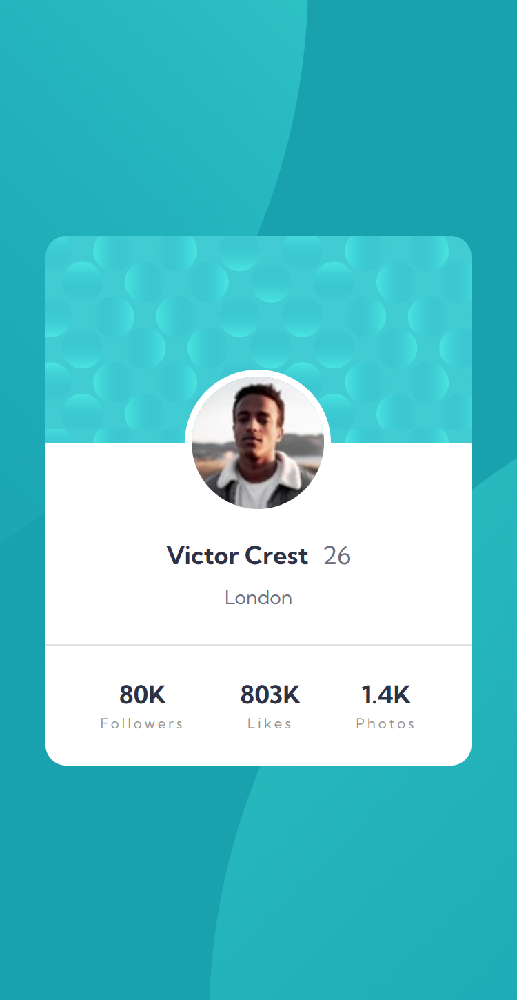
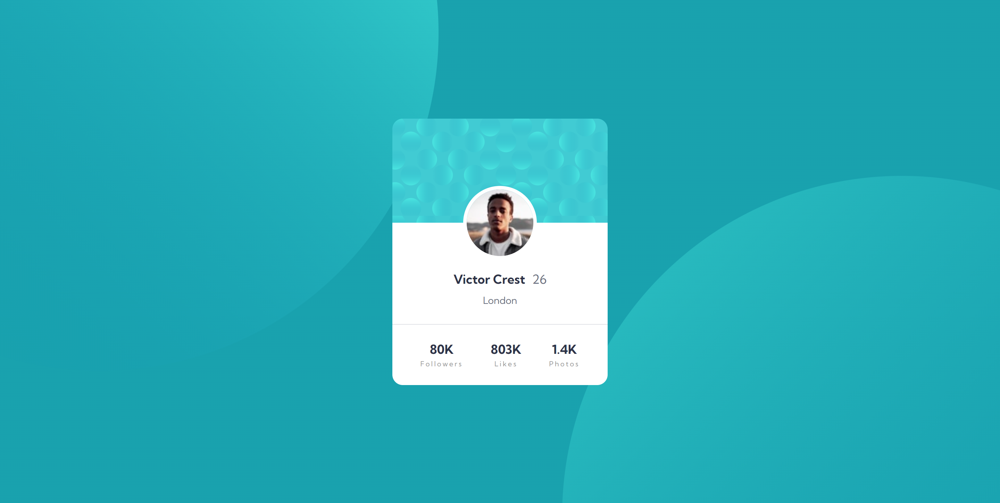

# Frontend Mentor - Profile card component solution

This is a solution to the [Profile card component challenge on Frontend Mentor](https://www.frontendmentor.io/challenges/profile-card-component-cfArpWshJ). Frontend Mentor challenges help you improve your coding skills by building realistic projects.

## Table of contents

- [Overview](#overview)
  - [The challenge](#the-challenge)
  - [Screenshot](#screenshot)
  - [Links](#links)
- [My process](#my-process)
  - [Built with](#built-with)
  - [What I learned](#what-i-learned)
  - [Continued development](#continued-development)
  - [Useful resources](#useful-resources)
- [Author](#author)

## Overview

### The challenge

- Build out the project to the designs provided

### Screenshot

### Links

- Live Site URL: [Live site URL](https://profile-card-component-mysolution.netlify.app/)

## My process

### Built with

- Semantic HTML5 markup
- Sass
- Flexbox
- CSS Grid
- Mobile-first workflow

### What I learned

I learned how to add multiple background images simultaneously and position them.

### Continued development

Overall HTML and Css

### Useful resources

- [Jonas Schmedtmann HTML and CSS course on udemy](https://www.udemy.com/course/design-and-develop-a-killer-website-with-html5-and-css3/)

## Author

- Frontend Mentor - [@Abu-Sman](https://www.frontendmentor.io/profile/Abu-Sman)
- Twitter - [@Abu_Sman01](https://www.twitter.com/Abu_Sman01)
